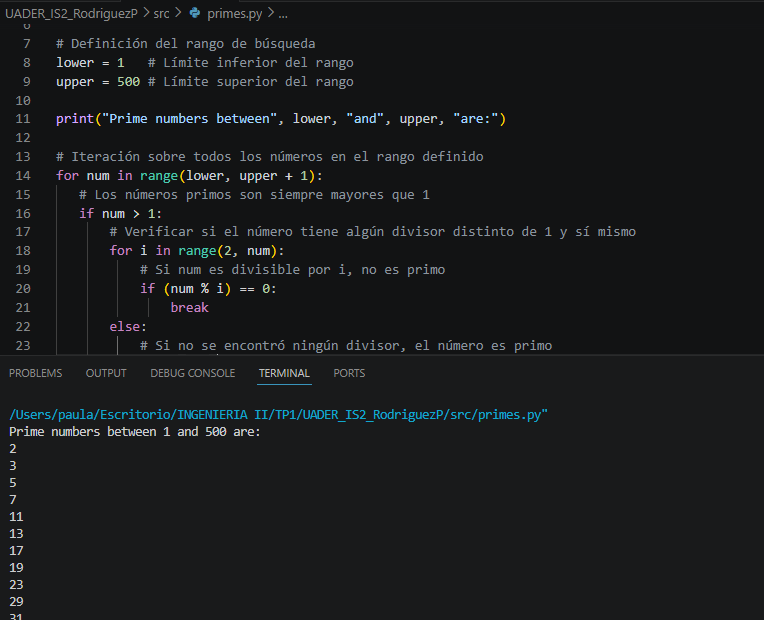

# UADER_IS2_RodriguezP

## Descripción
Repositorio correspondiente al TP1 de la materia Ingeniería de Software II - UADER.

## Estructura del proyecto

### Carpetas
- **src/** — Código fuente de los programas
- **doc/** — Documentación del proyecto
- **bin/** — Archivos binarios y ejecutables
- **script/** — Scripts auxiliares

## Programas incluidos

### Números Primos
Calcula e imprime los números primos en un rango dado.

### Factorial
Calcula el factorial de un número o rango de números.

## Ejemplo de ejecución

## Pasos para ejecutar

1. Clonar el repositorio con `gh repo clone UADER_IS2_RodriguezP`
2. Navegar a la carpeta `src`
3. Ejecutar con `python3 nombre_programa.py`

## Tecnologías utilizadas
- Python 3
- Git
- GitHub CLI

## Referencias
- [Documentación oficial de Python](https://www.python.org/doc/)
- [GitHub CLI](https://cli.github.com)